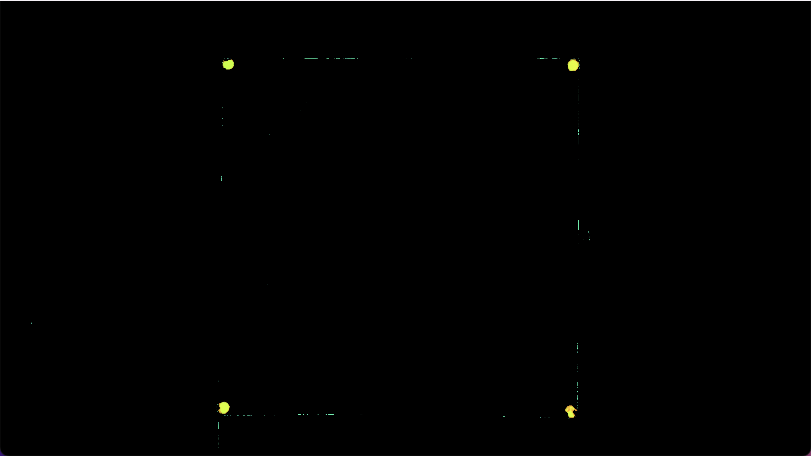
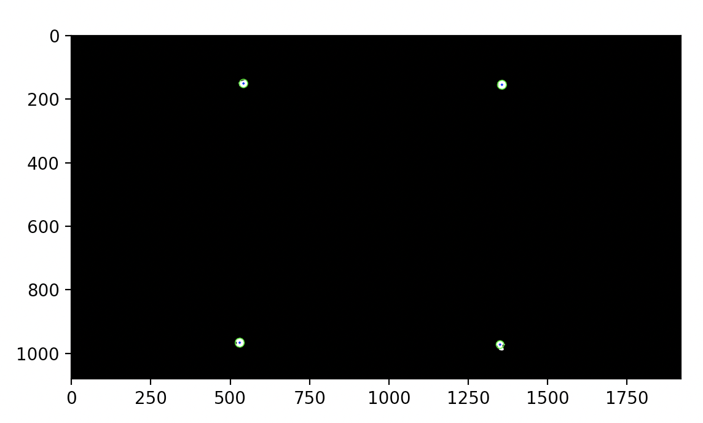

# Projeto de Róbótica Industrial - automatic chess player
Estudantes do Sétimo Semestre do Curso de Engenharia Mecatrônica do Insper. Curso de Robótica Industrial.

## Introdução

## Visão Computacional

O uso da biblioteca OpenCV, para visão computacional, através da linguagem de programação em Python, foi essencial para avanço do projeto.
Foi utilizada uma Câmera Web Logitech C920e Full HD 30FPS, que captura uma imagem do tabuleiro após a jogada feita pelo adversário. O robô entende que a jogada foi finalizada após o adversário ter apertado o botão de finaização de sua jogada. 

O processo da análise de imagem, cujo objetivo é recohecer a jogada feita pelo adversário, ocorrre nos seguintes passos:
- preparação do tabuleiro
- captura da imagem
- detecção do tabuleiro
- detetecção de casas vazias e cores das peças

### Preparação do tabuleiro
Nos vértices do tabuleiro de xadrez, foi colocado adesivos de cor vermelha, para facilitar a idnetificação pela WebCam. 

### Captura da imgem
A captura da imagem acontece pelo referenciamento da porta que ela esta sendo ultilizada e também da definição de parametros desejados. Os parametrso escolhidos definem um tamanho especifico da image, assim, como paramtros que ajudam em sua posterior analise, dada a ambiente do local.

```
cam_port = 1
cam = cv.VideoCapture(cam_port, cv.CAP_DSHOW)

#Set camera parameters
cam.set(cv.CAP_PROP_FRAME_WIDTH, 1920)   # Set frame width
cam.set(cv.CAP_PROP_FRAME_HEIGHT, 1080)   # Set frame height
cam.set(cv.CAP_PROP_BRIGHTNESS, 128)    # Set brightness (0.0 to 1.0)
cam.set(cv.CAP_PROP_CONTRAST, 128)      # Set contrast (0.0 to 1.0)
cam.set(cv.CAP_PROP_SATURATION, 120)    # Set saturation (0.0 to 1.0)
cam.set(cv.CAP_PROP_EXPOSURE, -5)       # Set exposure (-7.0 to -1.0 for manual exposure)
```
A foto do tabuleiro, pela visão da camera se encontra abaixo.


### Detecção do tabuleiro

Após ter a immagem crua do tabueliro e seus arredores, é transformada a imagem para a escala HSV, para que seja mais facil de detectar os adesivos vermelhos colocados (importante que não haja outros objetos vermelhos ao redor). 
Sabe se que a escala vermelha, em HSV, pode estar em regiões delimitadas abaixo.

```
 # lower boundary RED color range values; Hue (0 - 10)
lower1 = np.array([0, 120, 150])
upper1 = np.array([10, 255, 255])

# upper boundary RED color range values; Hue (160 - 180)
lower2 = np.array([160,200,20])
upper2 = np.array([179,255,255])
```

Assim, as cores detectadas são vistas na imagem abaixo.



Para limpeza da imagem é feito uma erosão, seguida de uma dilatação, da imagem, com o "MORPH_OPEN". Em seguida, é criado um kernel, que irá percorrer a imagem, e fazer uma borração, através do comando "medianBlur". Após esses processos, restará na imagem com somente os adesivos vermelhos desejados para localização do tabuleiro, sem imperfeições.

```
kernel = cv.getStructuringElement(cv.MORPH_RECT, (2, 2))
clean = cv.morphologyEx(full_mask, cv.MORPH_OPEN, kernel)
clean = cv.medianBlur(clean,5)
```
A imagem final, se encontra abaixo, transformando em escala HSV para escala GRAY.


Agora que existem a referencia do tabuleiro, é feito uma detecção do centro desses pequenos circulos e definiçcão de suas coordenadas dentro da imagem. A função HoughCircles detecta os circulos. Os parametros usados na função foram selecionados empiricamente até o resultado ideal.

```
circles = cv.HoughCircles(img,cv.HOUGH_GRADIENT,dp=1,minDist=200,param1=3,param2=5,minRadius=0,maxRadius=20)
```

A imagem abaixo mostra a deteccao desses dos circulos e seu centro.



Assim, foram definidos 4 quadrantes. 
Aquele círculo detectado no primeiro quadrante, foi denominado como "top_right"
Aquele círculo detectado no segundo quadrante, foi denominado como "top_left".
Aquele círculo detectado no terceiro quadrante, foi denominado como "bottom_left"
Aquele círculo detectado no quarto quadrante, foi denominado como "bottom_right"


