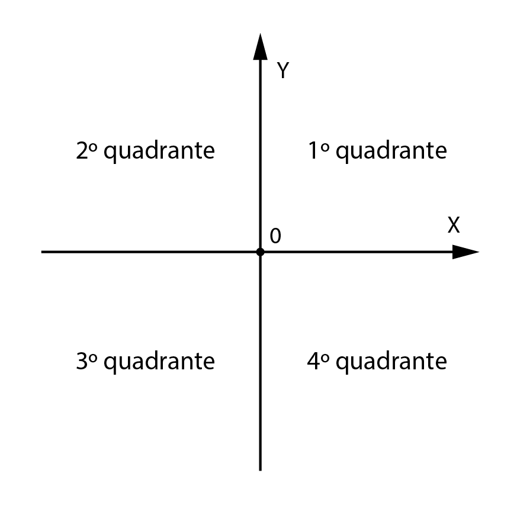
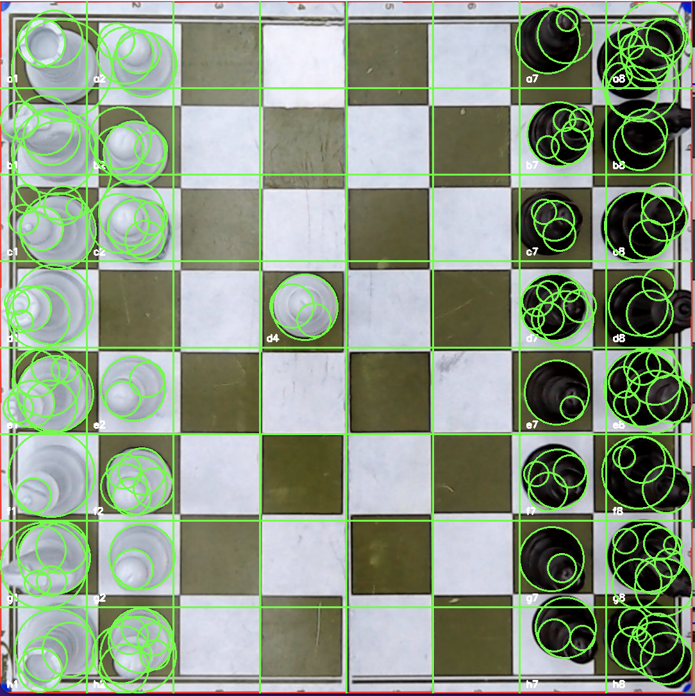

# Projeto de Róbótica Industrial - automatic chess player
Estudantes do Sétimo Semestre do Curso de Engenharia Mecatrônica do Insper, para disciplina de Robótica Industrial.

## Introdução

## Visão Computacional

O uso da biblioteca OpenCV, para visão computacional, através da linguagem de programação em Python, foi essencial para avanço do projeto.
Foi utilizada uma Câmera Web Logitech C920e Full HD 30FPS, que captura uma imagem do tabuleiro após a jogada feita pelo adversário. O robô entende que a jogada foi finalizada após o adversário ter apertado o botão de finaização de sua jogada. 

O processo da análise de imagem, cujo objetivo é recohecer a jogada feita pelo adversário, ocorrre nos seguintes passos:
- preparação do tabuleiro
- captura da imagem
- detecção do tabuleiro
- detetecção de casas vazias e cores das peças
- comunicação com o código central

### Preparação do tabuleiro
Nos vértices do tabuleiro de xadrez, foi colocado adesivos de cor vermelha, para facilitar a idnetificação pela WebCam. 

### Captura da imgem
A captura da imagem acontece pelo referenciamento da porta que ela esta sendo ultilizada e também da definição de parametros desejados. Os parâmetros escolhidos definem um tamanho especifico da imagem, assim como parâmetros que ajudam em sua posterior análise, dado o ambiente do local.

```
cam_port = 0
cam = cv.VideoCapture(cam_port, cv.CAP_DSHOW)

#Set camera parameters
cam.set(cv.CAP_PROP_FRAME_WIDTH, 1920)   # Set frame width
cam.set(cv.CAP_PROP_FRAME_HEIGHT, 1080)   # Set frame height
cam.set(cv.CAP_PROP_BRIGHTNESS, 128)    # Set brightness (0.0 to 1.0)
cam.set(cv.CAP_PROP_CONTRAST, 128)      # Set contrast (0.0 to 1.0)
cam.set(cv.CAP_PROP_SATURATION, 120)    # Set saturation (0.0 to 1.0)
cam.set(cv.CAP_PROP_EXPOSURE, -5)       # Set exposure (-7.0 to -1.0 for manual exposure)
```
A foto do tabuleiro, pela visão da camera se encontra abaixo.


### Detecção do tabuleiro

Após ter a imagem crua do tabuleiro e seus arredores, é transformada a imagem para a escala HSV, para que seja mais fácil de detectar os adesivos vermelhos colocados (importante que não haja outros objetos vermelhos ao redor). 
Sabe se que a escala vermelha, em HSV, pode estar em regiões delimitadas abaixo.

```
 # lower boundary RED color range values; Hue (0 - 10)
lower1 = np.array([0, 120, 150])
upper1 = np.array([10, 255, 255])

# upper boundary RED color range values; Hue (160 - 180)
lower2 = np.array([160,200,20])
upper2 = np.array([179,255,255])
```

Assim, as cores detectadas são vistas na imagem abaixo.


Para limpeza da imagem é feito uma erosão, seguida de uma dilatação, da imagem, com o "MORPH_OPEN". Em seguida, é criado um kernel, que irá percorrer a imagem, e fazer uma borração, através do comando "medianBlur". Após esses processos, restará na imagem com somente os adesivos vermelhos desejados para localização do tabuleiro, sem imperfeições.

```
kernel = cv.getStructuringElement(cv.MORPH_RECT, (2, 2))
clean = cv.morphologyEx(full_mask, cv.MORPH_OPEN, kernel)
clean = cv.medianBlur(clean,5)
```
A imagem final, se encontra abaixo, transformando em escala HSV para escala GRAY.


Agora que existem as referência do tabuleiro, é feito uma detecção do centro desses pequenos círculos e definição de suas coordenadas dentro da imagem. A função HoughCircles detecta os círculos. Fois estipilado um valor minimo e ma'ximo do raio desse circulo, assim ccomo a distancia minima entre eles. Os parametros, como dp, param1 e param2, foram selecionados empiricamente até o resultado ideal, sabendo que representam uma maior facilidade, ou dificuldade, para encontrar os círculos.

```
circles = cv.HoughCircles(img,cv.HOUGH_GRADIENT,dp=1,minDist=200,param1=3,param2=5,minRadius=0,maxRadius=20)
```


Assim, foram definidos 4 quadrantes. 
Aquele círculo detectado no primeiro quadrante, foi denominado como "top_right"
Aquele círculo detectado no segundo quadrante, foi denominado como "top_left".
Aquele círculo detectado no terceiro quadrante, foi denominado como "bottom_left"
Aquele círculo detectado no quarto quadrante, foi denominado como "bottom_right"


A imagem abaixo mostra a deteccao desses dos círculos e seu centro detectado.


E os quadrantes dos pontos:



Um dos ultimos passos para a detecção do tabuleiro, é traçar um polígono usando as quatro coordenadas dos pontos vermelhos, como um tabuleiro.
Usando polylines, foi desenhado esse polígono, e após isso, foi criado uma máscara sobre a imagem original, resultando em uma nova imagem. 

```
square = cv.polylines(board, [pts], 
                    isClosed, color, thickness)

# Criar a máscara preta do mesmo tamanho da imagem
mask = np.zeros_like(board)

#Preencha o polígono na máscara com branco
cv.fillPoly(mask, [pts], (255, 255, 255))

# Aplique a máscara à imagem original para obter a ROI
result = cv.bitwise_and(board, mask)

# Encontre os limites da região não-nula na máscara
(y, x) = np.where(mask[:, :, 0] != 0)
(top_y, bottom_y) = (np.min(y), np.max(y))
(left_x, right_x) = (np.min(x), np.max(x))

```

Por fim, uma última manipulação necessária é, redimensionar a imagem para se enquadrar como um tabuleiro, já que a imagem pode estar torta, pelo não alinhamento dos adesivos vermelhos. Assim, define-se as coordeandas dos centros dos pontos vermelhos, como os vértices da nova imagem.

Foi usado o comando abaixo, que transforma a matriz orginial na matriz desejada.

```
# Defina os pontos na ordem correta
input_pts = np.float32([[top_left[0], top_left[1]],
                        [bottom_left[0], bottom_left[1]],
                        [bottom_right[0], bottom_right[1]],
                        [top_right[0], top_right[1]]])

# Defina as coordenadas de saída
output_pts = np.float32([[0, 0], [0, height],
                        [width, height], [width, 0]])

# Calcule a matriz de transformação
M = cv.getPerspectiveTransform(input_pts, output_pts)

# Aplique a transformação de perspectiva
out = cv.warpPerspective(img_copy, M, (img_copy.shape[1], img_copy.shape[0]), flags=cv.INTER_LINEAR)
```

A imagem final foi a seguinte:


### Detetecção de casas vazias e cores das peças

Para finalizar o processo de análise da imagem, é necessário detectar os espaços vazios do tabuleiro (porque assim detecta-se a jogada feita pelo adversário), e as cores das peças (porque assim detecta-se movimentos de eliminação de uma peça).

Para isso, foi dividio a imagem trabalhada em um grid 8x8, como um tabuleiro virtual de xadrez, e nomeado cada bloco como o próprio tabuleiro, a1, a2, a2, b1, b2 etc... sendo a letra a coluna e o número a linha do grid.

Dessa forma, tendo ele dividido, loops são percorridos em cada bloco para extração dos dados.

Para detectar a presença de peça, é usado novamente o HoughCircles, cujos parametros também foram definidos empiricamente, a fim de se ter uma precisão maior, sem a presença de falsos positivos, nem falsos negativos.

```
circles = cv.HoughCircles(gray, cv.HOUGH_GRADIENT, dp=1, minDist=20, param1=50, param2=30, minRadius=0, maxRadius=0)
```
O resultado foi o seguinte:



Assim, é visto as casas que não possuem uma peça, para futura identificação da jogada.

Porém, para jogadas que comem a peça do adversário, além de identificar os blocos que possuem peça, é necessario identifcar qual a cor dessa peça. Isso acontece pois quando existe esse tipo de jogada, um novo bloco vazio é criado, porém um novo bloco ocupado não é formado, e sim substituído pela peça que comeu.  

Assim, para cada bloco com peça, é criado um circulo de analise e seu centro. Se a cor preodminante for mais próxima de branco, é considerado como peça branca, e caso for mais próxima de preto, será considerado uma peça preta.

O seguinte codigo demonstra isso:


### Comunicação com o código central


Assim, é enviado para o código central do xadrez, qual foi feita a jogada pelo adversário, pois é sabido a disposiccao das peçcas anterior a foto e também, agora, posterior.


